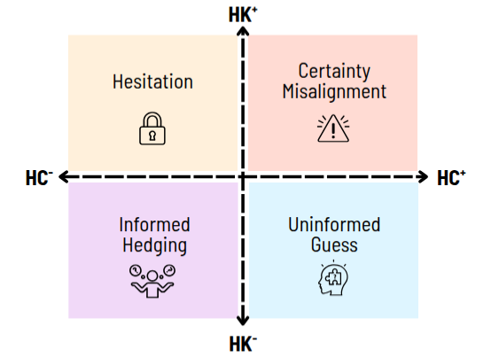

# HACK: Hallucinations Along Certainty and Knowledge axes

## Abstract
We propose a novel framework for categorizing hallucinations along two axes: **knowledge** and **certainty**.
Since parametric knowledge and certainty may vary across models, our categorization method involves a model-specific dataset construction process that differentiates between those types of hallucinations.
Along the knowledge axis, we distinguish between hallucinations caused by a lack of knowledge and those occurring despite the model having the knowledge of the correct response.
To validate our framework along the knowledge axis, we apply steering mitigation, which relies on the existence of parametric knowledge to manipulate model activations.
This addresses the lack of existing methods to validate knowledge categorization by showing a significant difference between the two hallucination types.
We further analyze the distinct knowledge and hallucination patterns between models, showing that different hallucinations do occur despite shared parametric knowledge.
Turning to the certainty axis, we identify a particularly concerning subset of hallucinations where models hallucinate \emph{with certainty} despite having the correct knowledge internally.
We introduce a new evaluation metric to measure the effectiveness of mitigation methods on this subset, revealing that while some methods perform well on average, they fail disproportionately on these critical cases.
Our findings highlight the importance of considering both knowledge and certainty in hallucination analysis and call for targeted mitigation approaches that consider the hallucination underlying factors.  

## Setup Instructions
To run the 3rd section results which investigates hallucination on the knowledge axis go to the folder **section_3**.

To run the 4th section result which investigate the certainty misalignment phenomenon fo to the folder **section_4**.

## Cite

@article{simhi2025hackhallucinationscertaintyknowledge,
      title={HACK: Hallucinations Along Certainty and Knowledge Axes}, 
      author={Adi Simhi and Jonathan Herzig and Itay Itzhak and Dana Arad and Zorik Gekhman and Roi Reichart and Fazl Barez and Gabriel Stanovsky and Idan Szpektor and Yonatan Belinkov},
      year={2025},
      eprint={2510.24222},
      archivePrefix={arXiv},
      primaryClass={cs.CL},
      url={https://arxiv.org/abs/2510.24222}, 
}

