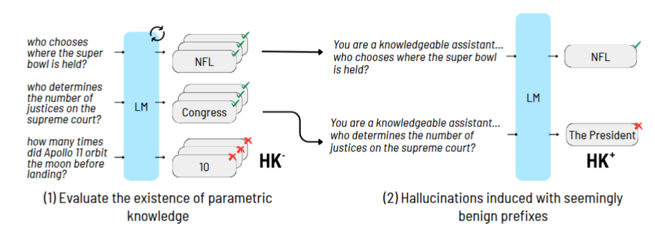

# Hallucination on the knowledge axis
Along the knowledge axis, we distinguish between hallucinations caused by a lack of knowledge and those occurring despite the model having the knowledge of the correct response.
To validate our framework along the knowledge axis, we apply steering mitigation, which relies on the existence of parametric knowledge to manipulate model activations.


## Setup Instructions

This code works for Linux.
First create and activate the environment specified by `environemnt.yml`
To run the 4th section result go to the folder Section_4.

## Usage

### Create the dataset

To create the labeled dataset and save them in the datasets folder run the following command:

```bash
python RunAllSteps.py --dataset_size 1000 --model_name model_name  --realistic True
--dataset_name naturalqa/triviaqa --run_dataset_creation True  
```

After this step you will have three files in the datasets folder: one that contains the word Hallucinate, one that contains the phrase
Non-Hallucinate and one that starts with General. The Hallucinate file contains the datapoints that are classified as
hallucinations, the Non-Hallucinate file contains the datapoints that are classified as non-hallucinations (factually-correct),
and the General file contains the datapoints that are ether hallucination because of not-knowing (0 in count_knowledge)
or are from a different knowledge place in the spectrum.

We can create the same way dataset for Alice/Truthful/Persona setting, and create files that their name starts with Alice/Truthful/Persona, by adding
the flag `--alice True or --persona True or --truthful True`.

Additionally, this step also creates the Generic (static) dataset that contains only hallucinations and grounded
data points with no regard to the two hallucination types and to the model's specific hallucinations.

Each data point in the specific dataset contains:
clean_prompt, golden_answer, wrong_answer, golden_answer_token, wrong_answer_token, prompt_with_setting_starter, count_knowledge,-1

For the generic dataset each data point contains:
clean_prompt, golden_answer, wrong_answer, golden_answer_token, wrong_answer_token, prompt_with_setting_starter, -1, -1

### Create Inner States Information

To create inner states information, that will be used in the next steps, run the following command (the inner
states files will be saved in folder
results/model_name/dataset_name/1/concat_answer{False/True}_size{dataset_size}/setting):

```bash
python RunAllSteps.py --dataset_size 1000 --model_name model_name  --dataset_name dataset_name --run_initial_test True
```
Again to do it to a different setting add the setting name and True such as `--alice True` or `--persona True` or `--truthful True`.

### Run steering Mitigation to validate the knowledge axis categorization


```bash
python steering.py --model_name model_name --dataset_name dataset_name --setting Realistic --alpha 5.0 --concat True --hk_ 
```
To run on HK+ remove the --hk_ flag and to run on other settings change the --setting flag to Alice/Truthful/Persona


### Generalization results between different prompt settings

```bash
python RunAllSteps.py --generalization True
```
This will calculate the generalization between the prompt settings for the three models (meta-llama/Meta-Llama-3.1-8B, google/gemma-2-9b, mistralai/Mistral-7B-v0.3) we used in the paper.


## Repository Structure
The repository is organized as follows:
- README.md: This README file.
- datasets/: Folder containing the created datasets.
- results/: Folder containing the results of the experiments.
- RunAllSteps.py: Main script to run the different steps of the experiments.
- steering.py: Script to run the steering mitigation experiments.
- environment.yml: Conda environment file for setting up dependencies.
- models_config.py: Configurations for different models used in the experiments.
- model_inside.py: Extracting inner states from models.
- model_wrapper.py: Internal code to extract hidden states.
- generalization.py: Script to calculate generalization results between different prompt settings.
- dataset_creation.py: Script to create the labeled datasets based on model knowledge and hallucination types.
