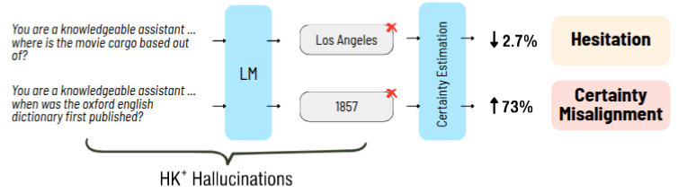

# Hallucination on the certainty axis

This work shows the existence of high-certainty hallucinations in LLMs, where models confidently generate incorrect answers despite possessing the correct knowledge.



## Setup Instructions
This code works for Linux.
First create and activate the environment specified by `environemnt.yml`
To run the 3rd section result go to the folder Section_3.

## Usage
### Knowledge Detection
To create a knowledge dataset of a given model_name using either natural_question/triviaqa datasets, run the following command and replace model_name with the desired model and dataset_name with either natural_question or triviaqa:
```bash
python run_all_steps.py --create_knowledge_dataset True --model_name model_name --path_to_datasets datasets/ --dataset_name natural_question/triviaqa
```

The saved files will be in the **datasets** folder. Containing three json files, one with the ending _knowledge_dataset.json_, 
which are all the examples the model has the knowledge to answer correctly, one with the ending _non_knowledge_dataset.json_, 
which are all the examples the model does not have the knowledge to answer correctly, and one with the ending _else_dataset.json_,
which are all the examples the model have partial knowledge to answer correctly.
### Uncertainty Calculation
To create uncertainty calculations for the knowledge dataset, run the following command and replace method_k_positive with the desired method (e.g., prompt_7):
```bash
python run_all_steps.py --uncertainty_calculation True --model_name model_name --path_to_datasets datasets/ --dataset_name natural_question/triviaqa --method_k_positive prompt_7
```
At the end of this step you will have the following files in the **results** folder:
model_name/dataset_name/method_k_positive/factuality_stats.json
model_name/dataset_name/method_k_positive/hallucinations_stats.json

In the factuality_stats.json are all the examples the model generated the correct answer under the given method_k_positive setting.
In the hallucinations_stats.json are all the examples the model generated a wrong answer under the given method_k_positive setting.
### In each json is a list of dictionaries with the following keys:
1. prob: the probability of the first answer token, generated: the generated text under the given method_k_positive,
2. true_answer: the true answer,prob_diff: the difference between the probability of the most likely and second likely next token,
3. semantic_entropy: the semantic entropy of the generated text, mean_entropy: the predictive entropy, 
4. most_likely_tokens: top 5 most likely tokens, temp_generations: are the generations using temperature of 1,
5. semantic_entropy_temp_0.5: the semantic entropy of the generated text using temperature of 0.5 instead of 1,
6. mean_entropy_temp_0.5: the predictive entropy using temperature of 0.5 instead of 1,
7. temp_generations_temp_0.5: are the generations using temperature of 0.5 instead of 1,
8. prompt: the prompt used to generate the text.

### Results
To generate the graphs and tables for the results of the uncertainty calculations, run the following command:
```bash
python run_all_steps.py --run_results True  --path_to_datasets datasets/ 
```


## Repository Structure
The repository is organized as follows:
- README.md: This README file.
- run_all_steps.py: Main script to run knowledge dataset creation, uncertainty calculation, and results generation.
- environment.yml: Conda environment file for setting up dependencies.
- semantic_entropy: Module for calculating semantic entropy (Kuhn et al., 2023).`
- calc_semantic_entropy.py: Script to calculate semantic entropy.
- uncertainty_calculations.py: Module for uncertainty calculation methods.
- knowledge_detection.py: Module for knowledge detection step.
- results_sub.py: Module for generating results (graphs and tables).
- datasets/: Directory to store datasets.
- results/: Directory to store results.

